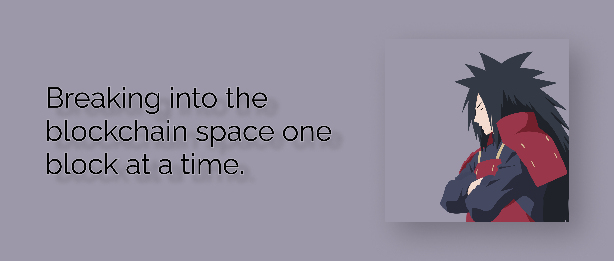

    <h3>Hello Visitor, Namaste</h3>

Myself &nbsp; <strong style="font-size:1.5rem; font-family:Verdana">Satya </strong>

I am a Freelane Full Stack Blockchain Developer | Technical Content Creator | Open Source Enthusiast

##### My Skills are:

<strong>Blockchain</strong>

-   Solidity
-   Truffle, Hardhat
-   Web3js, ethersjs

<strong>Full Stack</strong>

-   Django
-   Djago REST framework
-   React JS

Things I like to talk about

-   Anime (Naruto)
-   Web3, blockchain, and metaverse

FAQs on me

-   
Favorite Naruto Character:<strong> Madara</strong>, Itachi, Naruto

-   
I work both hourly based / project based.

-   
I develop contracts using truffle / hardhat based on your requirement and I use django for backend and reactjs for frontend.

            

             
         &nbsp;   &nbsp; 
     &nbsp; 
